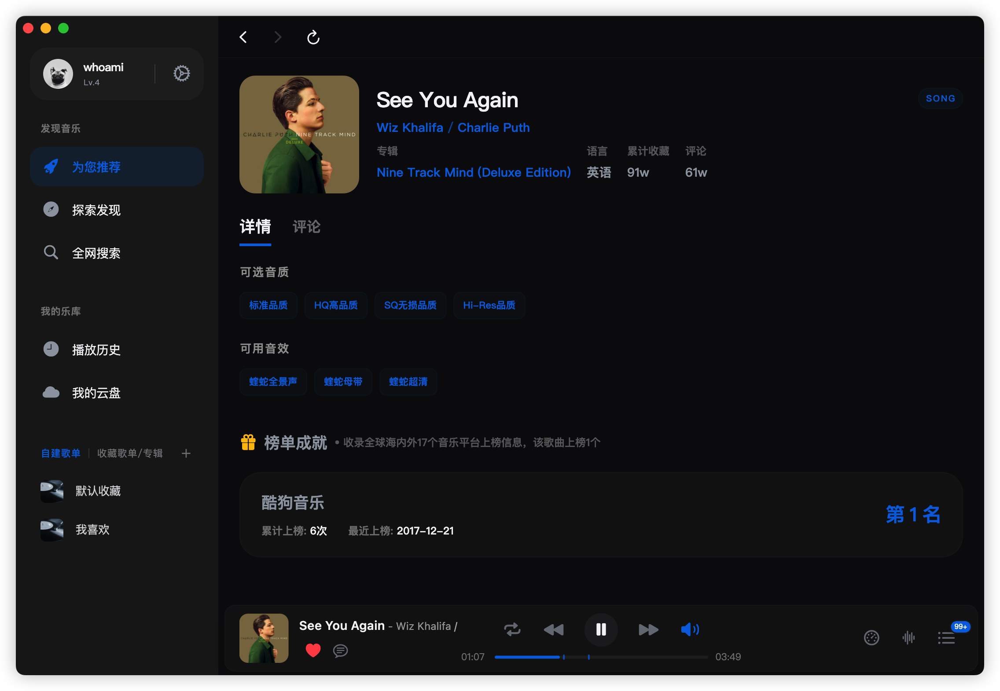
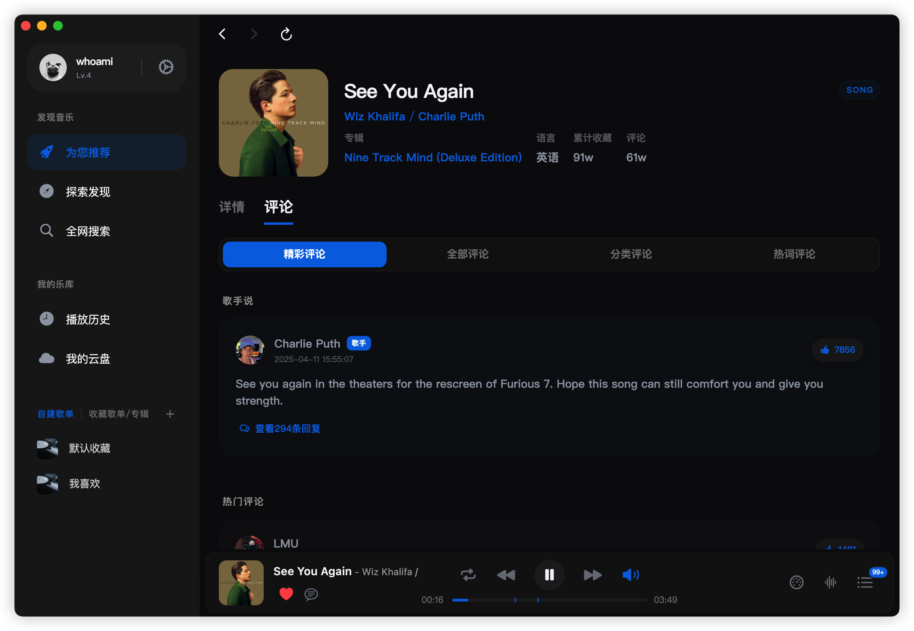
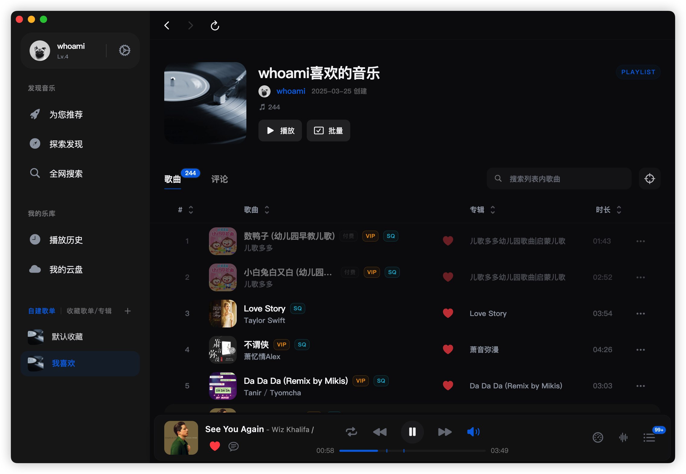
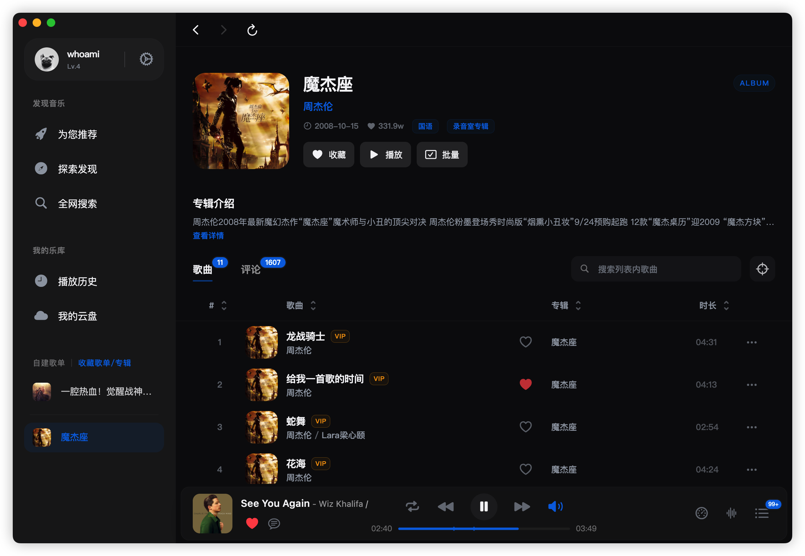
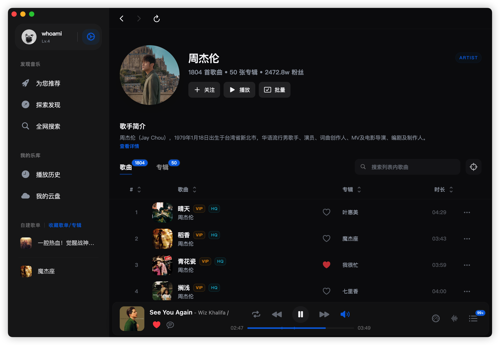
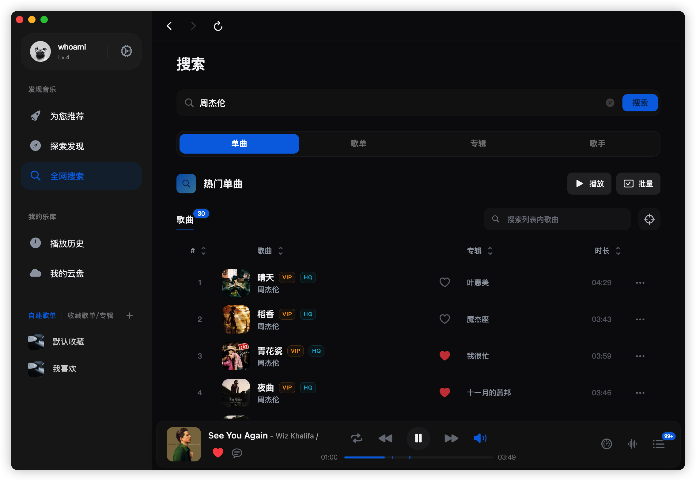
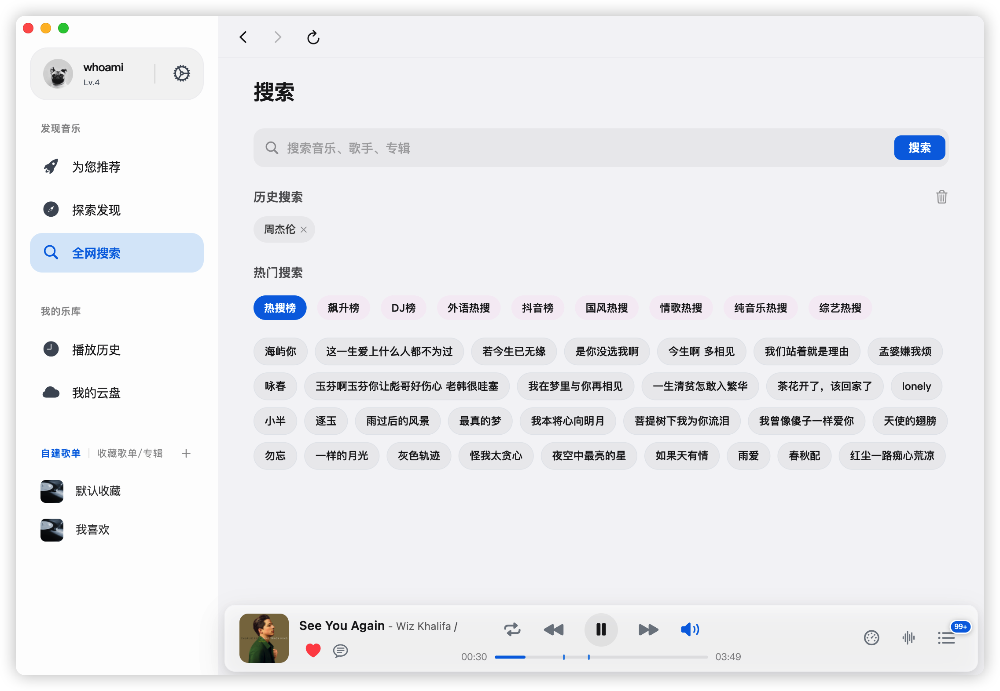
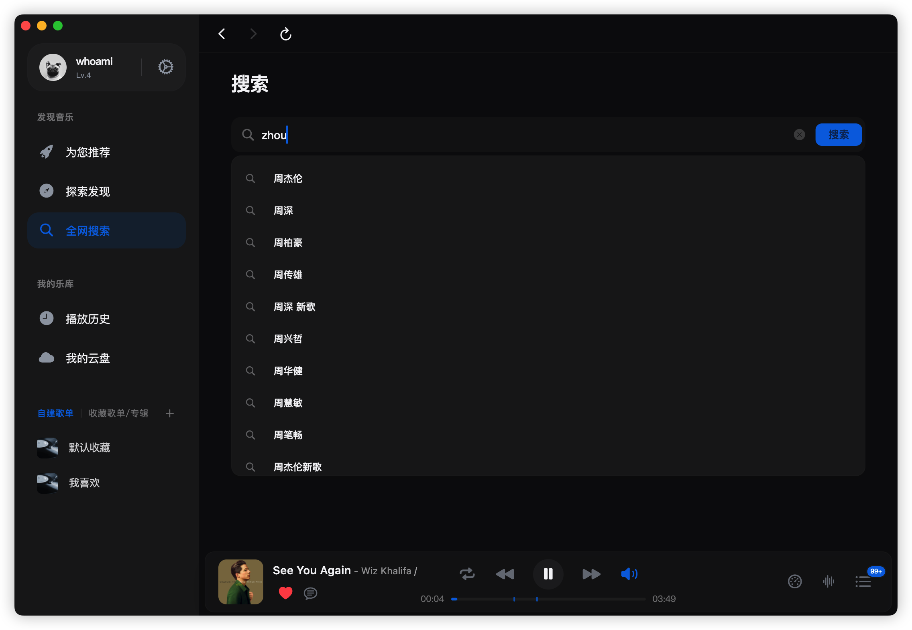
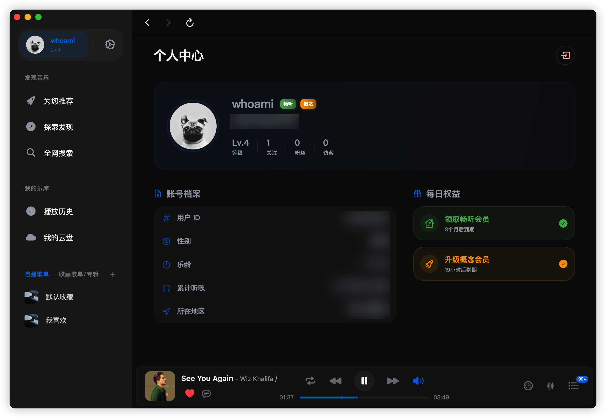
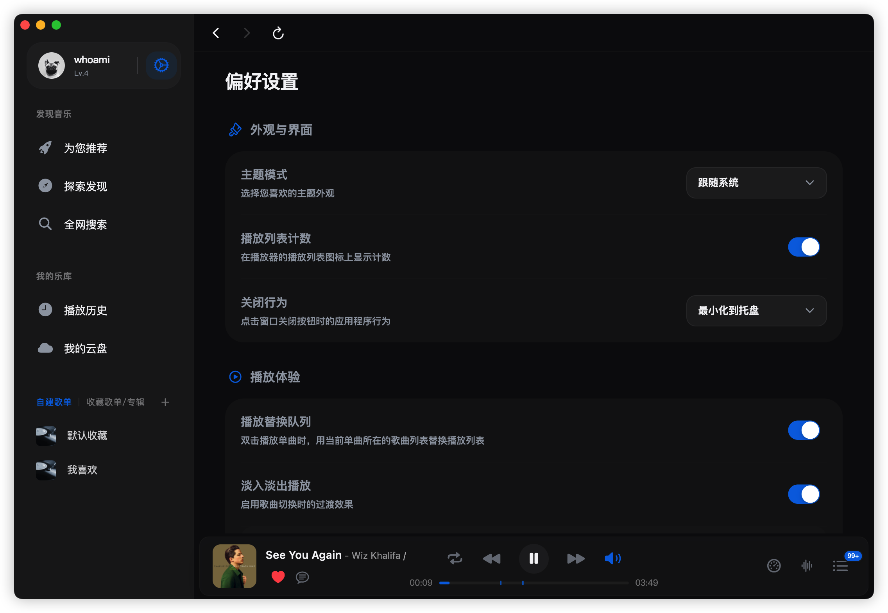

# EchoMusic

<p align="center">
  
</p>

<p align="center">
  <strong>EchoMusic</strong> —— 一个专为桌面端打造的简约、精致、功能强大的第三方音乐播放器。
</p>

<p align="center">
  
  
  
  
  
</p>

---

## ✨ 核心特性

- **极致美学**：精心适配桌面端布局，支持深浅色模式，兼顾信息密度与沉浸式体验。
- **数据安全**：官方服务器直连，数据不经过第三方服务器，保证用户数据安全。
- **音乐推荐**：支持歌曲、歌单、歌手、专辑、排行榜等内容推荐。
- **多维探索**：支持歌曲、歌手、专辑、歌单全方位搜索，快速发现心仪旋律。
- **进阶播放**：支持播放队列管理、播放模式切换、音量调节、进度拖动等核心播放能力。
- **歌曲详情**：支持查看歌曲档案及播放详情。
- **歌曲评论**：支持查看歌曲评论与评论楼层跳转。
- **歌词显示**：支持 LRC 歌词解析、滚动同步、全屏歌词、桌面歌词。
- **系统集成**：支持窗口控制、系统托盘、托盘快捷控制、全局快捷键。
- **持久化能力**：支持设置、播放历史、收藏、播放状态等本地持久化。
- **跨平台支持**：完整适配 macOS、Windows 与 Linux 系统。
- **持续集成**：完善的 GitHub Actions 配置，支持多平台自动构建与 Release 发布。

## 音质音效

- **音质**：Hi-Res、SQ(flac)、HQ(320)、标准(128)
- **音效**：钢琴、人声伴奏、骨笛、尤克里里、唢呐、DJ、蝰蛇母带、蝰蛇全景声、蝰蛇超清

## 🛠️ 技术栈

- **Desktop Shell**: [Electron](https://www.electronjs.org/)
- **Frontend**: [Vue 3](https://vuejs.org/) + [TypeScript](https://www.typescriptlang.org/)
- **Build Tool**: [Vite](https://vitejs.dev/)
- **State Management**: [Pinia](https://pinia.vuejs.org/) + [pinia-plugin-persistedstate](https://prazdevs.github.io/pinia-plugin-persistedstate/)
- **UI Primitives**: [Reka UI](https://reka-ui.com/)
- **Routing**: [Vue Router](https://router.vuejs.org/)
- **Package Manager**: [pnpm](https://pnpm.io/)
- **Backend Service**: [Node.js](https://nodejs.org/)（内置本地服务）

## 🖼️ 界面截图

- 首页
  
- 发现
  
- 歌词
  
- 歌曲详情
  
- 歌曲评论
  
- 播放列表
  
- 专辑
  
- 歌手
  
- 搜索
  
  
  
- 个人中心
  
- 设置
  

## 🚀 快速开始

### 前置要求

- [Node.js](https://nodejs.org/) 18+
- [pnpm](https://pnpm.io/) 9+

### 本地开发

1. **克隆仓库**
   ```bash
   git clone https://github.com/hoowhoami/EchoMusic.git
   cd EchoMusic
   ```

2. **安装依赖**
   ```bash
   pnpm install
   cd server
   npm install
   cd ..
   ```

3. **启动应用**
   ```bash
   pnpm dev
   ```

> 开发模式下会由 Electron 主进程自动拉起本地服务端。

## 🏗️ 编译发布

项目使用 GitHub Actions 进行自动化构建。每当推送 `v*` 格式的 Tag 时，会自动触发多平台构建并将二进制包上传至 Releases。

**手动编译：**
```bash
pnpm build
```

## 📦 打包产物

- **macOS**：`dmg`、`zip`
- **Windows**：`exe (nsis)`、`portable`
- **Linux**：`deb`、`rpm`、`AppImage`、`tar.gz`

## macOS

```bash
xattr -cr /Applications/EchoMusic.app && codesign --force --deep --sign - /Applications/EchoMusic.app
```

## 交流群
- [Telegram](https://t.me/+H9vpkAJrDlViZjU1)

## 💡 灵感来源

本项目受到以下优秀开源项目的启发：

- [KuGouMusicApi](https://github.com/MakcRe/KuGouMusicApi) - 酷狗音乐 NodeJS 版 API
- [SPlayer](https://github.com/imsyy/SPlayer) - 一个简约的音乐播放器
- [MoeKoeMusic](https://github.com/MoeKoeMusic/MoeKoeMusic) - 一款开源简洁高颜值的酷狗第三方客户端

## 📄 免责声明

本项目是基于公开 API 接口开发的第三方音乐客户端，仅供个人学习和技术研究使用。

- **数据来源**：所有音乐数据通过公开接口获取，本项目不存储、不传播任何音频文件
- **版权声明**：音乐内容版权归原平台及版权方所有，请尊重知识产权，支持正版音乐
- **使用限制**：禁止将本项目用于任何商业用途或违法行为
- **责任声明**：因使用本项目产生的任何法律纠纷或损失，均由使用者自行承担
- **争议处理**：如版权方认为本项目侵犯其权益，请通过 Issues 联系，我们将积极配合处理

**本项目不接受任何商业合作、广告或捐赠。**

## ⚖️ 开源协议

基于 [MIT License](LICENSE) 协议发布。
